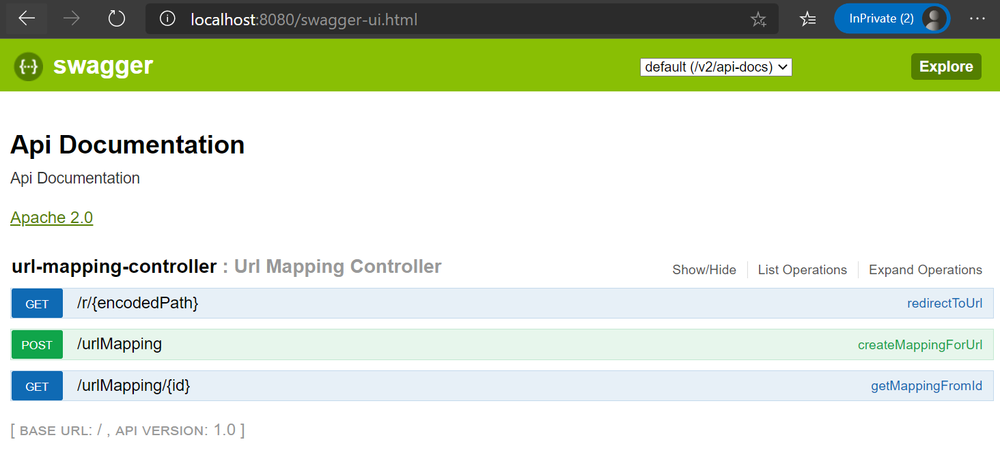
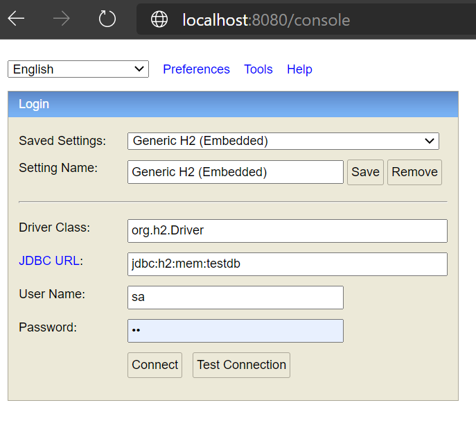

See requirements [here](requirements.md)

# Overview
This application exposes RESTful API's to create a TinyURL. 

## Technologies Used
- Java 8
- Spring Boot
- H2
- Hibernate
- JPA
- Lombok (trim down boilerplate Java code)
- Swagger

## Approach
The approach I used was:
- Utilize Spring Boot to be able to quickly bootstrap a Java application
- Use H2 in memory database to get a quick Relational DB as persistent store
- Use JPA / Hibernate so when switching to production database we don't have to switch code
- For the algorithm, create a Bijective Function to convert ID's to Strings with alpha numeric characters

The URL it redirects to is currently hardcoded to path `/r/{encodedPath}` (r is short for redirect), because using base path would then override ability to have other endpoints, such as `POST /urlMapping`

The main code prinicples followed here are:
- Layered architecture (gui, presentation, business, infrastructure)
- Separation of Concerns (Helped by layered architecture)
- Single Responsibilty (Don't have functions or classes doing more than they should)
- Dependency Inversion (Injecting implementation at runtime helps testability)

# Running
Pre-req: Must have Java 8 installed and JAVA_HOME set

At the top level directory

`./gradlew bootRun`
or
`./gradlew.bat bootRun`

After starting the application, you can see the swagger API's at:

http://localhost:8080/swagger-ui.html#/

To view the database go here:
http://localhost:8080/console

And put in parameters like this (password is sa):

